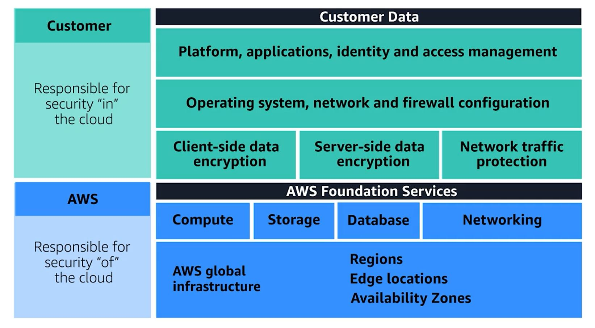
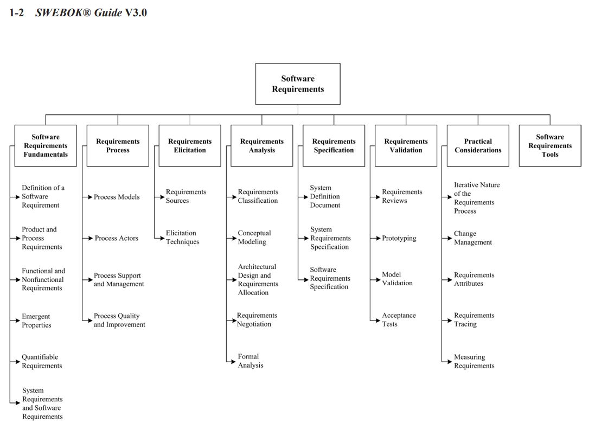

# Security Testing

## Author:
- Truc Huynh
- Mohammed Alswairki
- [Link to Research Paper-Word File](https://ind657-my.sharepoint.com/:w:/g/personal/huyntl02_pfw_edu/EREQ8HZ5ZnpEmlgh66AqLR0Bc5Aj6R21wPnLuFMnwC4k5g?e=LA2CBC)

## 1. Introduction:
- Knowledge Requirement: Cybersecurity, Industry Standard Infrastructure, Software Development, Software Construction, Software Testing, Security Testing
- Level can be range from easy to expert depend on skill levels
- Types of Security Testing
```
- Vulnerability Scanning
- Penetration Testing (Ethical Hacking)
- Web Application Security Testing
- API Security Testing
- Configuration Scanning
- Security Audits
- Risk Assessment
- Security Posture Assessment
```
- Testing vs. Validation

###a. Best Practices:
- <b>Build security into Software Engineering Process</b> -> before design need to
implement this
- Check the consistency of the software
- Test everything to make sure we are secure
- Working with developer team to implement server structures that are industry standards (AWS, Azure) if possible.
```
	- The benefit of implement the security they already built in the system and implement it
```
- Develop security methods to prevent insider attack and outsider attack
```
	- An insider attack is a malicious attack on a net work or authorized system cause by an authrized person (admin)
```

###b. Test Plan for Security Testing
Functional Testing and Non-Functional Testing of Client (password salting, user login page, encrypt user information, the choice to hide password...)

Security Structure of AWS Cloud


#### Protection Testing with Client/Server communication:
- [Testing communication between a client and a server](https://www.ibm.com/docs/en/ibm-mq/7.5?topic=installation-testing-communication-between-client-server)
- Man in the middle attack
```
Man in the middle attack is a general term when someone be able to interfare with a one on one communication(client to client, server to server, client to server (mostly happen))
- normal people cn quickly realize that is not their friend (facebook account steal)
```
- Example on AWS Shared responsibility model
```
- AWS: Responsible for "security" of the cloud:  AWS is responsible for protecting the infrastructure that runs all of the services offered in the AWS Cloud. 
This infrastructure is composed of the hardware, software, networking, and facilities that run AWS Cloud services.
- Client: Responsibility “Security in the Cloud”:  Take care the Operating System (OS Key): deploy security patch, update, maintaince... Client also responsible 
for application running on their system. Lastly, they are responsible for managing their data (including encryption options), classifying their assets, 
and using IAM tools to apply the appropriate permissions
```


## Introduction:
### Software Security Testing:
- Security Testing or Software Testing Security determines that software protects data and maintains security specification as given.
- Security testing uncovers vulnerabilities of the sysytem and determines that the data and resources of the system are safe.

### Software Quality:
- Computer programs, procedures, and possibly associated documentation and data pertaining to the operations of the system (IEEE)
- Four component that need to assure the quality of the software development: code, procedures, documentation, data to poerating the software system (from ISO 9000-3).

### Software Testing Life Cycle (Testing Framework):
when the testing team perform activities to ensure the quality of the software by steps. That process is called Software testing life cycle (STLC)
- Requirement Analysis: When the SRD is ready and shared with the stakeholders, the testing team starts high level analysis concerning the AUT (Application under Test).
- Test Planning: plans the strategy and approach.
- Test Case Designing: Develop the test cases based on scope and criteria’s.
- Test Environment Setup–When integrated environment is ready to validate the product.
- Test Execution: Real-time validation of product and finding bugs.
- Test Closure: Once testing is completed, matrix, reports, results are documented
(Retrieved from 4)

### Software Requirements:


# Software Faults

## Unintended Error:
### Software error: made by programmer
- Syntax (grammatical) error:
- Logic error (multiply instead of adding two operands)

### Software Fault:
- All software errors may not cause software faults
- That part of the software may not be executed

### Software Failures:
- A software fault becomes a software failure when/if it is activated.
- Faults may be found in the software due to the way the software is
executed or
- Other constraints on the software’s execution, such as execution
options.

## Intended Action:
- Hackers take advantage of weak security to gain their benefits.
- Hackers create opportunities so that they can hack in the application (man-in-the-middle attack)

## Hacker Motivation:
- Achieving Financial Gains
  - steal credit cards information
  - misusing data (apply for loans, cars, credit cards)
  - selling data on Dark Web
- Carrying Out Political Agendas
- Performing Corporate Espionage
- Proving a Point (Hacktivist)
- Taking personal Revenge
- Causing Harm for Personal Enjoyment
- Mitigating Cyber Threats

## Reference:
- IEEE: [Advance Technology for Humanity](https://www.ieee.org/) (1)
- ISO 9000-3: [Quality management and quality assurance standards](https://www.iso.org/standard/26364.html) (2)
- SWEBOK V3.0: [Guide to the Software Engineering Body of Knowledge](https://ieeecs-media.computer.org/media/education/swebok/swebok-v3.pdf) (3)
- Tutorial Point: STLC Tutorial(https://www.tutorialspoint.com/stlc/index.htm) (4)
- Software Testing | Security Testing (https://www.geeksforgeeks.org/software-testing-security-testing/?ref=lbp) (5)
- Security Testing: Types, Tools, and Best Practices (https://www.neuralegion.com/blog/security-testing/) (6)
- API Security: The Complete Guide (https://www.neuralegion.com/blog/api-security/) (7)
- Hacker Motivation: Why Do Hackers Hack? (https://sectigostore.com/blog/hacker-motivation-why-do-hackers-hack/) (8)

## Contributing
Please read [CONTRIBUTING.md](CONTRIBUTING.md) for details on our code of conduct, and the process for submitting pull requests to us.
## Versioning
We use [SemVer](http://semver.org/) for versioning. For the versions available, see the [tags on this repository]().
## Authors
* **Truc Huynh** - *Initial work* - [TrucDev](https://github.com/jackyhuynh)
* **Mohammed Alswairki** - *Initial work*
## Format
my README.md format was retrieved from
* **Billie Thompson** - *Initial work* - [PurpleBooth](https://github.com/PurpleBooth)

