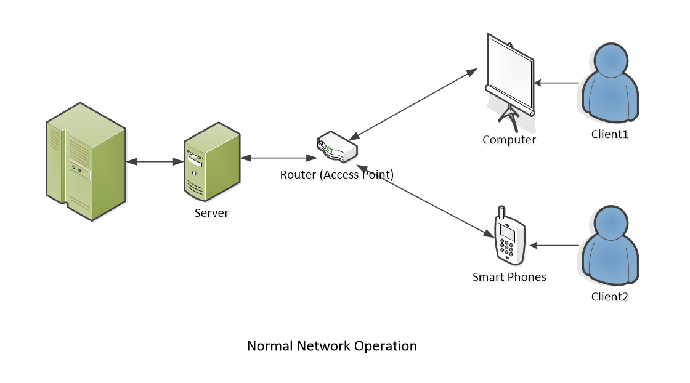
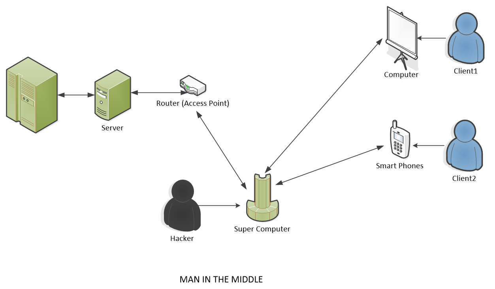

# Software Security Testing

- Determining that software protects data and maintains security specifications as given
- Uncovering vulnerabilities of the system and determine that the data and resources of the system are well-protected
- Ensuring that the software system and application are free from any threats or risks that can cause a loss
- To understand and implement good test plans for security testing we must understand what is software quality, software development framework (SDLC) software testing life-cycle (STLC), software requirements, and major issues that cause security breaches

# Unintended Error

- Software error:
  - Are errors made by the programmer
  - Syntax (grammatical) error
  - Logic error (multiply instead of adding two operands)
- Software Fault:
  - All software errors may not cause software faults since they may not be executed
- Software Failures:
  - A software fault becomes a software failure when/if it is activated
  - Faults may be found in the software due to the way the software is executed
  - Other constraints on the software’s execution, such as execution options

# Intended Action

- Hackers take advantage of weak security to gain their benefits
- Hackers create opportunities so that they can hack into the applications or systems
- Intended actions are punished by federal law (maximum is severed 20 years in prison)

# Hacker Motivation

- Achieving financial gains
- Carrying out political agendas
- Performing corporate espionage
- Proving a point (Hacktivist)
- Taking personal revenge
- Causing harm for personal enjoyment
- Mitigating cyber threats

# Security-related Bugs vs. Traditional Bugs

- Security-related bugs can differ from traditional bugs in several ways:
  - Security testing is often fundamentally different from traditional testing because it emphasizes what an application should not do rather than what it should do [9]
  - Malicious attackers do intelligently search for vulnerabilities. If they succeed, they cause problems for other users, who may be adversely affected. Compounding the problem, malicious hackers are known to script successful attacks and distribute them
  - Since most developers are not currently trained in secure programming practices, security analysts carry a greater burden in verifying that secure programming practices are adhered to
  - Many security requirements can be neither refined nor dropped even if they are un-testable. e.g.  ”an attacker should never be able to take control of the application,” would be regarded as un-testable in a traditional software development setting 
- Retrieved from [9]

# Software Security Testing in related with SDLC

- Secure software development is intrinsically harder than traditional software development. Therefore, software testing has the strengths that can be leveraged during secure software development
- Testing can help confirm that the developers did not overlook some insecure programming practices
- A vulnerability is usually taken more seriously if there is a known exploit for it, but developing exploits is the domain of penetration testing
- Testing can be used to help identify and mitigate risks from third-party components, where development artifacts like source code and architecture diagrams are unavailable.
- Testing can be used to provide metrics of software insecurity and help raise the alarm when software is seriously flawed from a security standpoint

# Software Security Testing in related with SDLC (cont.)

- Every design artifact views the software system at a certain level of abstraction:
  - Attackers like to find the abstractions used by developers and work their way around them
  - No person or group can view a software system at all possible levels of abstraction, but testing can help by perhaps finding (at least some) flaws that are not visible in the design artifacts [9]
- It is often said that security testing is only a small part of secure programming [10]
- It is very difficult to find all security-related problems in a software system 
- Thus, no effective mitigation strategy should be overlooked

# Software Security Testing Goal

- To identify the threats in the system
- To measure the potential vulnerabilities of the system
- To help in detecting every possible security risk in the system
- To help developers in fixing the security problems through coding

# Software Security Testing Principle

- Confidentiality
- Integrity
- Authentication
- Authorization
- Availability
- Non-repudiation

# Types of Security Testing

- Vulnerability Scanning: 
  - Scan a system to detect the known vulnerability patterns
- Security Scanning: 
  - Is the identification of network and system weaknesses 
- Penetration Testing: 
  - Is the simulation of the attack from a malicious hacker
- Risk Assessment: 
  - Testing security risks observed in the organization are analyzed
- Security Auditing: 
  - Is an internal inspection of applications and operating systems for security defects
- Ethical Hacking: 
  - Ethical hacking aims to expose security flaws in the organization’s system
- Posture Assessment: 
  - Combining security scanning, ethical hacking, and risk assessments to provide an overall security posture of an organization.

# Simulate Man-In-The-Middle Attack on a Private Network

- Python Scapy Package: 
  - Scapy is a powerful Python-based interactive packet manipulation program and library 
- Kali Linux: 
  - is an open-source, Debian-based Linux distribution. Pre-installed more than 600 tools for security tasks and hacking [11]
- Cyber Security principles 
- Networking Principles: 
  - Understanding of MAC Address, Access Point, Address Resolution Protocol (ARP), Domain Name Server (DNS) 
- Understanding of OSI Model and TCP/IP Model: 
  - Understand Layers Architecture of OSI Model and TCP/IP Models, Understand IPV4 and IPV6 
- Web Application Structures: (Client-Server Model) 
- Python Programming: 
  - String Manipulation, Parsing HTML, Sending & receiving HTTP requests, Netfilterqueue, Socket Programming, Data Structures, OOP

# Tools that is used in Man-In-The-Middle Attack

- MAC Address Changer
- Network Scanner
- ARP Spoofer (ARP Cache Poisoning)
- Packet Sniffer
- DNS Spoofer (DNS Cache Poisoning)
- File Interceptor

# Senario

- Demonstrate how to implement a man-in-the-middle-attack on a private network (or a private system that we don’t have permission to get access to). 
- All tools will be written from scratch [13] using Python Scapy and Kali Linux.
- The benefit of writing our own hacking tools is that hackers can automate the whole hacking process, implemented machine learning & artificial intelligence, and provide efficient source code control
- Private networks usually exist on a physical building with access within that building

# How Hackers Gain Access to The System

- Access can be gained in many ways: 
  - insider attack, 
  - malware backdoor, 
  - code Injector, 
  - malware package
- The focus is to simulate the strategy that hackers spread out the virus after gaining access and controlling the system

# Hacking Plans

- Use remote devices that are set up within the building or gain control of one of the devices within the organization to perform the task
- Starting with one device then spread the attack to all other devices
- Each of the devices gets accessed by the hacker can become bots and send out information, or spread out the virus to other devices within the network
- Some viruses can contain themselves, create a backdoor, and pass security scanners by changing their MAC address or IP address

# Hacking Plan Steps
- Step 1 Get Access to one computer
- Step 2 Established Man-In-The-Middle
- Step 3 Gather information
- Step 4 Modify Data, spread virus
- Step 5 Evaluation

# Diagram of System Under Normal Operation

- Under normal operation, each client is connected to an access point within the organization (inside its building). Please notice access to the private network only can be granted within access points within the building (wired and wireless)

Images by Truc Huynh

# Diagram of Access-gain (Step 1)

Images by Truc Huynh

# Diagram of Established Man-In-The-Middle (Step 2)

Images by Truc Huynh

# Execution Diagram

Execution order of Tools

Images by Truc Huynh

# Steps Diagram

Steps Diagram

Images by Truc Huynh

# Step 1: Get Access to one computer: 
  - Through a USB stick equipped with a custom Linux version, physically plug in
  - Enable backdoor on user’s computer

# Step 2: Established Man-In-The-Middle:
  - Redirect the flow of packet by running ‘ARP Spoofer’
  - ‘ARP Spoofer’ will run ‘Network Scanner’ to get all the IP and Mac addresses on the network and store the result 
  - Finally run ‘Mac Address Changer’ to change our MAC address hacking devices to a physical MAC address of a local computer

Images by Truc Huynh

# Step 3: Gather information
  - Using ‘Packet_Sniffer’ to read the packet and data flow through the hacker interface.
  - Use the information that ‘Packet Sniffer’ collect to create a suitable plan for spreading the virus to another machine within the network
  - Can be done with AI and ML (monitor the frequency of the one user visit one website)

Images by Truc Huynh

# Step 3: Gather information (cont.)

Images by Truc Huynh

# Packet Sniffing Architecture

Images by Truc Huynh

# Step 4 Modify Data, spread virus
  - Using the plan that creates on step 3 to attack other computers. 
  - Depend on security structure on the network using ‘DNS Spoofer’ or ‘File Interceptor’ (or both)
  - Using ‘File Interceptor’ to modify HTTP data that send over HTTP, replace a user’s download request with a completely different file (virus, backdoor…)
  - Using ‘DNS Spoofer’ (modify data in DNS Layer) to redirect the destination on the computer on the network (e.g. to a fake website) so that the hacker can install a backdoor on another local computer
  
# Step 4 (cont.)
  - Slowly spread and contain them-self, avoid detection by the network administrator, or any security system on the network
  - Step 4 can be enhanced with machine learning and decision making algorithm.

Images by Truc Huynh

#  Step 5 Evaluation:
  - Decide if the attack is a success or not.
  - Make sure the attack doesn’t create any evidence that leads to the hacker (protocol tracing, IP Address tracing).
  
# Reference

- [IEEE: Advance Technology for Humanity](https://www.ieee.org/) [1]
- [ISO 9000-3: Quality management and quality assurance standards](https://www.iso.org/standard/26364.html) [2]
- [SWEBOK V3.0: Guide to the Software Engineering Body of Knowledge](https://ieeecs-media.computer.org/media/education/swebok/swebok-v3.pdf) [3]
- [Tutorial Point: STLC Tutorial](https://www.tutorialspoint.com/stlc/index.htm) [4]
- [Software Testing | Security Testing](https://www.geeksforgeeks.org/software-testing-security-testing/?ref=lbp) [5]
- [Security Testing: Types, Tools, and Best Practices](https://www.neuralegion.com/blog/security-testing/) [6]
- [API Security: The Complete Guide](https://www.neuralegion.com/blog/api-security/) [7]
- [STLC (Software Testing Life Cycle) Phases, Entry, Exit Criteria (guru99.com)](https://www.guru99.com/software-testing-life-cycle.html) [8]
- Fink, G. & Bishop, M. "Property-Based Testing: A New Approach to Testing for Assurance." ACM SIGSOFT Software Engineering Notes 22, 4 (July 1997): 74-80.[9]
- McGraw, Gary & Potter, Bruce. "Software Security Testing." IEEE Security and Privacy 2, 5 (Sept.-Oct. 2004): 81-85. [10a]
- McGraw, Gary. "Application Security Testing Tools: Worth the Money?" Network Magazine, November 1, 2004.  (2004). [10b]
- [Kali Linux](https://www.kali.org/?msclkid=ccbd3c3faa2511ecbe541363c15a4582) [11]
- [Python Scapy Package](https://pypi.org/project/scapy/?msclkid=33343ba2aa2611eca8b9c3abfd8b35c1) [12]
- [Truc Huynh: Ethical Hacking Using Python](https://github.com/jackyhuynh/ethical-hacking-using-python) [13]
- [Udemy: Learn Python and Ethical Hacking from Scratch](https://www.udemy.com/course/learn-python-and-ethical-hacking-from-scratch/learn/lecture/10800892#overview) [14]
