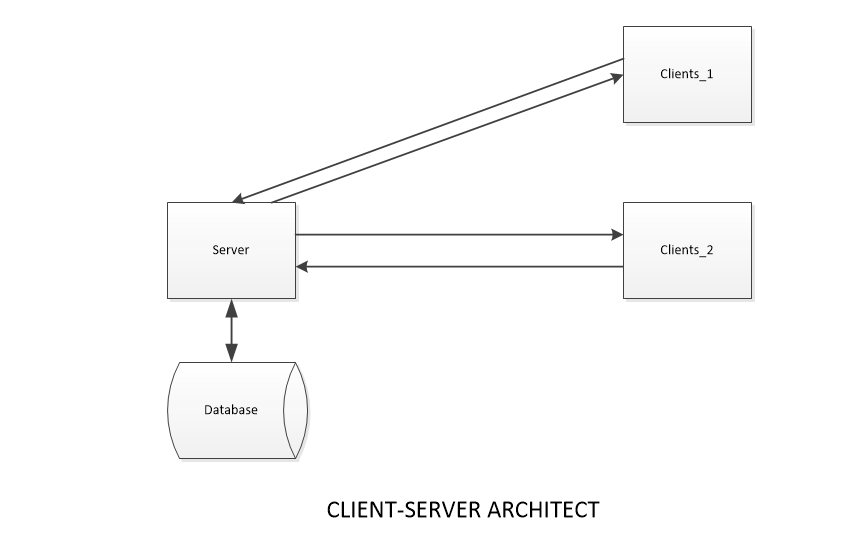

# Security Testing and Cyber-Security: Simulated Man in The Middle Attack and Prevention

## Author:
- Truc Huynh
- Mohammed Alswairki
- [Link to Research Paper-Word File](https://ind657-my.sharepoint.com/:w:/g/personal/huyntl02_pfw_edu/EREQ8HZ5ZnpEmlgh66AqLR0Bc5Aj6R21wPnLuFMnwC4k5g?e=LA2CBC)

## I. Introduction to Software Testing Security:
- Security Testing or Software Testing Security determines that software protects data and maintains security specification as given. 
Another word to say: security testing uncovers vulnerabilities of the system and determines that the data and resources of the system are well protected.
It ensures that the software system and application are free from any threats or risks that can cause a loss.
- To understand and implement good security test plans we must understand what is software quality,  
software testing lifecycle (testing framework), and software requirements. 
We also need to understand major issues that cause security breaches which are software failures, malware, ransomware and cybersecurity principle
- Topic cover in this research:
  - Software Quality
  - Software Testing Life Cycle (STLC/ Testing framework)
  - Software Requirements
  - Security Breaches: Errors/Faults/Failures
  - Types of Security Testing
- Testing Tools implement in this research:
  - Regression Testing
  - Automation Testing (Using Script)
  - Code Reviews
  - Ethical Hacking

### A. Security Testing Goal
  -	To identify the threats in the system.
  -	To measure the potential vulnerabilities of the system.
  -	To help in detecting every possible security risk in the system.
  -	To help developers in fixing the security problems through coding.

### B. Security Testing Principle
  -	Confidentiality
  -	Integrity
  -	Authentication
  -	Authorization
  -	Availability
  -	Non-repudiation

### C. Major Focus Areas in Security Testing
  -	Network Security
  -	System Software Security
  -	Client-side Application Security
  -	Server-side Application Security

## II. What is software quality:
- Computer programs, procedures, and possibly associated documentation and data pertaining to the operations of the system (IEEE)
- Four component that need to assure the quality of the software development: code, procedures, documentation, data to operating the software system (from ISO 9000-3).
- Software design best practices:
  - The Best Practices is <b>building security into Software Engineering Process</b> before design and coding.
  - <b>Design need to be consistent</b>: Need to be an expert in cyber-security and software structure, and a beginner mind discovering new testing strategies

## III. Software Testing Life Cycle (STLC):

When the testing team perform activities to ensure the quality of the software by steps. That process is called Software testing life cycle (STLC). 
Design and implement a STLC is extremely important, it decides the success of a project [4].

By terminology, Software Testing Life Cycle (STLC) is a sequence of specific activities conducted during the testing 
process to ensure software quality goals are met. STLC involves both verification and validation activities. 
STLC consists of a series of activities carried out methodologically to help certify software products. Below is the 6 steps of a Software Testing Life Cycle.  [1]

### A. Requirement Analysis: 
- When the Software Requirements Data is ready and shared with the stakeholders, 
the testing team starts high level analysis concerning the AUT (Application under Test).
- In this phrase, the test team studies the requirements from a testing point of view to identify testable requirements to understand requirements in detail. 
- Requirements could be either functional or non-functional.
- Requirement analysis activities:
  - Identify type of tests to be performed
  - Gather details about testing priorities and focus
  - Prepare Requirement Traceability Matrix (RTM)
  - Manually or Automation feasibility analysis
  - Retrieved from
- Deliverables of requirement analysis:
  - Requirement Traceability Matrix (RTM)
  - Manually or Automation feasibility report
- Retrieved from [7]

### B. Test Planning: 
- Plans the strategy, approach, and cost estimates.
- The resources, test environment, test limitations, and the testing schedule are also determined
- Main Activities in Testing Planning:
  - Preparation of test plan/strategy document for various types of testing
  - Test tool selection
  - Test effort estimation
  - Resource planning and determining roles and responsibilities.
  - Training requirement
  - Retrieved from [7]

- Deliverables of Test Planning:
  - Test plan /strategy document.
  - Effort estimation document
  - Retrieved from [7]

### C. Test Case Designing: 
- Develop (create, verification, and continues to develop) the test cases, and test scripts based on scope and criteria’s.
- Test Case Development Activities:
  -	Create test cases and automation script if applicable
  -	Review and baseline test case and script 
  -	Create test data if test environment is available
- Deliverables of Test Case Development:
  -	Test cases/scripts
  -	Test data
- Retrieved from [4]

### D. Test Environment Setup:
– When integrated environment is ready to validate the product.
- In this phase, testing team will decide the software and hardware conditions under which working products is tested.
- Test Environment Setup Activities:
  -	Understand the required architecture, environment set-up and prepare hardware and software requirement list for the Test Environment.
  -	Setup test Environment and test data.
  -	Perform smoke test on the build.

- Deliverables of Test Environment Setup:
  -	Environment ready with test data set up
  -	Smoke Test Result
- Retrieved from [4]

### E. Test Execution: 
- Real-time validation of product and finding bugs.
- The process consists of test script execution, test script maintenance and, bug reporting. If bugs are reported then it is reverted to the development team for correction and retesting will be performed.
- Test Execution Activities:
  - Execute tests as per plan
  - Document test results, and log defects for failed cases
  - Map defects to test cases in RTM
  - Retest the Defect fixes
  - Track the defects to closure
- Deliverables of Test Execution:
  - Completed RTM with the execution status
  - Test cases updated with results
  - Defect reports
- Retrieved from [4]

### F. Test Closure: 
- Once testing is completed, matrix, reports, results are documented. [4]
- Test Cycle Closure Activities:
  -	Evaluate cycle completion criteria based on Time, Test coverage, Cost, Software, Critical Business Objectives and Quality
  -	Prepare test metrics based on the above parameters.
  -	Document the learning out of the project
  -	Prepare Test closure report
  -	Qualitative and quantitative reporting of quality of the work product to the customer.
  -	Test result analysis to find out the defect distribution by type and severity.
- Deliverables of Test Cycle Closure:
  - Test Closure report
  - Test metrics
- Retrieved from [4]
  
## IV. Software Requirements and Requirement Analyst:
Understand the software quality and software requirements help us design better security test plan. More over, understand software requirement allows
developers using proper technology to design application.
### A. Software Requirements Fundamentals:
  - Definition of a Software Requirement: At its most basic, a software requirement is a
  property that must be exhibited by something in order to solve some problem in the real world
  - Product and Process Requirements: is a need or constraint on the software to be developed
  - Functional and Nonfunctional Requirement: Functional requirements describe the functions that the software is to execute. 
  Non-functional requirements: quality requirements (performance requirements, maintainability requirements, safety requirements, reliability requirements,
  security requirements, interoperability requirements or one of many other types of software requirements)
  - Emergent Properties: requirements that can not be addressed by a single component but that
  depend on how all the software components interoperate [3]
  - Quantifiable Requirements: Software requirements should be stated as clearly
  and as unambiguously as possible, and, where appropriate, quantitatively [3]
  - System Requirements and Software Requirements: System requirements are the requirements for
  the system as a whole. In a system containing software components, software requirements are
  derived from system requirements [3]

### B.  Requirements Process
  - Process Models: provide an understanding that the requirements process.
  - Process Actors: people who participate in the requirements process.
  - Process Support and Management
  - Process Quality and Improvement

### C. Requirements Elicitation
  - Requirement Sources
  - Elicitation Techniques
   
### D. Requirement Analyst
  - Requirement Classification 
  - Conceptual Modeling
  - Architecture Design & Requirement Allocation
  - Requirement Negotiation
    
### E. Requirements Specification
  - System Definition Documents
  - System Requirements Specification
  - Software Requirements Specification
    
### F. Requirements Validation
  - Requirements Reviews
  - Prototyping
  - Model Validation
  - Acceptance Test

### G. Practical Considerations
  - Iterative Nature of the Requirement Process
  - Change Management
  - Requirements Attributes
  - Requirements Tracing
  - Measuring Requirements

### H. Software Requirements Tools

Software requirements diagram

Images retrieved from [3]

## V. Security Breaches:
A security breach happen when a system fail in its security processes and cause
unauthorized party access to the system. A security breach can happen by software problems (error, fault, failures), outdated security technology,
ransomware, malware ...

### B. Software error: made by programmer
- Syntax (grammatical) error:
- Logic error (multiply instead of adding two operands)

### C. Software Fault:
- All software errors may not cause software faults
- That part of the software may not be executed

### D. Software Failures:
- A software fault becomes a software failure when/if it is activated. Faults may be found in the software due to the way the software is
executed or other constraints on the software’s execution, such as execution
options.

## VI. Types of Security Testing:
There are seven types of Security Testing:
### A. Vulnerability Scanning:
Vulnerability scanning is performed with the help of automated software to scan a system to detect the known vulnerability patterns.
### B. Security Scanning:
Security scanning is the identification of network and system weaknesses. Later on, it provides solutions for reducing these defects or risks. Security scanning can be carried out in both manual and automated ways.
### C. Penetration Testing:
Penetration testing is the simulation of the attack from a malicious hacker. It includes an analysis of a particular system to examine for potential vulnerabilities from a malicious hacker that attempts to hack the system.
### D. Risk Assessment:
In risk assessment testing security risks observed in the organization are analyzed. Risks are classified into three categories i.e. low, medium, and high. This testing endorses controls and measures to minimize the risk.
### E. Security Auditing:
Security auditing is an internal inspection of applications and operating systems for security defects. An audit can also be carried out via line-by-line checking of code.
### F. Ethical Hacking:
Ethical hacking is different from malicious hacking. The purpose of ethical hacking is to expose security flaws in the organization’s system.
### G. Posture Assessment:
It combines security scanning, ethical hacking, and risk assessments to provide an overall security posture of an organization.

## V. Basic Test Suite to Prevent Man-In-The-Middle-Attack:
- Test if users can directly access bookmarked web page without login.
- Test if system restrict users to download the file without log in.
- Test if previous accessed pages should not accessible after log out (i.e. Sign out and then press the Back button to access the page accessed before).
- Test if the industry standard username & password rules is enforced.
- Test if sensitive information ( passwords, ID numbers, credit card numbers, etc.) are stored as plain text. They should be encrypted and in asterix format.
- Test if bookmarking is disabled on secure pages by default.
- Test if source code is invisible to users.
- Test if older version web browsers can access the app (older version web browsers does not support SSL).
- Test if multiple attempt is being blocked.
- Test if system completely log out current user after time out.
- Test if users connection are stable and secure.
- Verify that relevant information (upload, download, activities) are written to the log files and that information should be traceable.
- Test if the SSL encryption is done correctly and verify the integrity of the information.
- Prevent same username to log in at the same time.
- Check if important credential update immediately.
- Test if error messages doesn't contain important information.

## VI. Use Case (Man in the Middle Attack):
In this use case I will demonstrate how to implement man in the middle attack on a system (that we are allowed to get access).
- Pre requirement:
  - Understanding of cyber-security
  - Understanding of Python Programing (automation and scripting)
  - Understanding of Kali Linux Command Line
  - Understanding of security testing methods (Vulnerability Scanning, Ethical Hacking, Security Auditing)
- Goal:
  - By pass the server or client security system and hack the information (username, password, important data).
- Scenario: 
  - Hacking the network of a company that can only access by computers within that building (can't access by devices from other network). Another word to say is get access to the access point
- Tools:
  - MAC Address Changer
  - Network Scanner
  - ARP Spoofer
  - Packet Sniffer
  - DNS Spoofer
  - File Interceptor

Images by Truc Huynh

### A. System under normal operation:
Under normal operation, each client is connected to access points within the organization (inside building).

Images by Truc Huynh

### B. Hacker Gain Access to The System
Access can be gain using insider attack, malware Backdoor , Code Injector, malware Package...
It doesn't matter how the hackers gain access to the system at this point. That can be discussed in another research paper.
My focus is to simulate the strategy that hacker spread out the virus and control the system.

Hacker can use a remote devices that set up within the building, or gain control to one of the devices 
within the organization to perform the task. They can start with one device first then access all devices.
Each of the devices get access by the hacker can become bots and sending out information, or spread out the virus

After gain access to the network, hackers can use tools such as Network Scanner, Mac Address Changer to become "Man in the Middle".
Depend on how many devices hackers want to control, they usually need a super computer to handle the task.

Images by Truc Huynh

### C. Hacker Establish Man-In-The-Middle

At this state, Hacker can use ARP Spoofer, Packet Sniffer, DNS Spoofer, File Interceptor... to get the information from server, 
spread out the virus (to control more machines)...

Images by Truc Huynh

## Reference:
- IEEE: [Advance Technology for Humanity](https://www.ieee.org/) [1]
- ISO 9000-3: [Quality management and quality assurance standards](https://www.iso.org/standard/26364.html) [2]
- SWEBOK V3.0: [Guide to the Software Engineering Body of Knowledge](https://ieeecs-media.computer.org/media/education/swebok/swebok-v3.pdf) [3]
- [Tutorial Point: STLC Tutorial](https://www.tutorialspoint.com/stlc/index.htm) [4]
- [Software Testing | Security Testing](https://www.geeksforgeeks.org/software-testing-security-testing/?ref=lbp) [5]
- [Security Testing: Types, Tools, and Best Practices](https://www.neuralegion.com/blog/security-testing/) [6]
- [API Security: The Complete Guide](https://www.neuralegion.com/blog/api-security/) [7]
- [STLC (Software Testing Life Cycle) Phases, Entry, Exit Criteria (guru99.com)](https://www.guru99.com/software-testing-life-cycle.html) [8]

